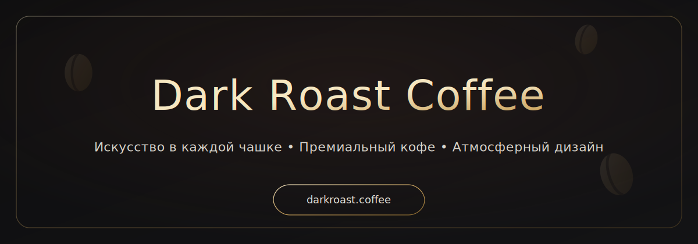

<p align="center">
  
</p>

# ☕ Dark Roast Coffee — Landing Page

Современный и элегантный лендинг для премиум-кофейни **Dark Roast Coffee**, созданный на **HTML5 + Tailwind CSS**.  
Проект разработан с акцентом на минимализм, атмосферу и удобство — адаптирован под все устройства и готов к продакшену.

Главное меню


Меню


Философия


Атмосфера


Бронирование


---

## ✨ Основные возможности

- ⚡ **HTML5 + Tailwind CSS** — современный стек без лишних зависимостей  
- 🎨 **Атмосферный UI** — тёмная палитра, кофейные акценты и минималистичный стиль  
- 📱 **Полная адаптивность** — от смартфонов до 4K-мониторов  
- 🧩 **Компонентный подход** — переиспользуемые классы для карточек, кнопок и секций  
- 🚀 **Лёгкий старт** — npm-скрипты для запуска и сборки  

---

## 📋 Требования

- [Node.js](https://nodejs.org/) **v12.x или выше**  
- npm или yarn  

---

## ⚙️ Установка и запуск

1. Установите зависимости:  
```bash
npm install
# или
yarn install

2. Запустите сервер разработки:
npm run dev
# или
yarn dev

3. Соберите проект для продакшена:
npm run build:css
# или
yarn build:css

📂 Структура проекта
html_app/
├── css/
│   ├── tailwind.css      # Tailwind source file + кастомные утилиты
│   └── main.css          # Скомпилированный CSS
├── pages/                # HTML-страницы проекта
├── index.html            # Главная страница (лендинг)
├── package.json          # Зависимости и скрипты
└── tailwind.config.js    # Конфигурация Tailwind CSS

🎨 Стилизация

Tailwind CSS с кастомными утилитами

Цветовая палитра:

🌑 Тёмный фон (глубокий серый/чёрный)

☕ Кофейные акценты (коричневые, терракотовые оттенки)

✨ Золотые и бронзовые детали для премиальности

📱 Адаптивность

Используются стандартные брейкпоинты Tailwind:

sm: ≥640px

md: ≥768px

lg: ≥1024px

xl: ≥1280px

2xl: ≥1536px

🙏 Благодарности

Разработано с любовью к кофе и коду ❤️

Основано на HTML5 и Tailwind CSS

