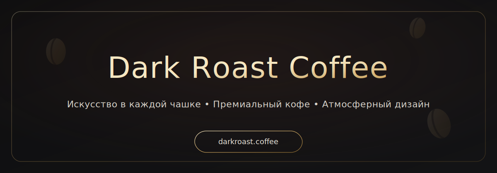

<p align="center">
  
</p>

<p align="center">
  
  
  
  
</p>

# Dark Roast Coffee

Премиальный многостраничный сайт кофейни в темной стилистике. Разработан на чистом HTML5 + Tailwind CSS с акцентом на атмосферу, минимализм и адаптивный дизайн. Готов к продакшену.

---

## Pages

| Страница | Файл | Описание |
|----------|------|----------|
| Homepage | `pages/homepage.html` | Главная страница с hero-секцией, навигацией и ключевыми блоками |
| Menu Experience | `pages/menu_experience.html` | Интерактивное меню с категориями напитков и десертов |
| Our Philosophy | `pages/our_philosophy.html` | Философия бренда, история и ценности кофейни |
| Atmosphere Gallery | `pages/atmosphere_gallery.html` | Галерея атмосферы заведения с фотографиями интерьера |
| Reservation System | `pages/reservation_system.html` | Система бронирования столиков с формой и выбором времени |
| Coffee Education | `pages/coffee_education_center.html` | Образовательный раздел: мастер-классы, способы заваривания |

---

## Tech Stack

- **HTML5** -- семантическая верстка, доступность
- **Tailwind CSS 3.4** -- утилитарный CSS-фреймворк с кастомной конфигурацией
- **Кастомная палитра** -- тёмные тона, кофейные акценты, золотые детали
- **Шрифты** -- Playfair Display, Source Sans Pro, Crimson Text, Montserrat
- **Адаптивный дизайн** -- от мобильных устройств до 4K-мониторов

---

## Quick Start

```bash
# Установить зависимости
npm install

# Собрать CSS
npm run build:css

# Открыть сайт
open index.html
```

Для режима разработки с автопересборкой:

```bash
npm run dev
```

---

## Project Structure

```
dark_roast_coffee/
├── css/
│   ├── tailwind.css          # Исходный Tailwind + кастомные утилиты
│   └── main.css              # Скомпилированный CSS
├── pages/                    # HTML-страницы сайта
│   ├── homepage.html
│   ├── menu_experience.html
│   ├── our_philosophy.html
│   ├── atmosphere_gallery.html
│   ├── reservation_system.html
│   └── coffee_education_center.html
├── public/                   # Статические ресурсы
├── index.html                # Точка входа (редирект на homepage)
├── tailwind.config.js        # Конфигурация Tailwind CSS
└── package.json              # Зависимости и скрипты
```

---

## Screenshots

Главная страница


Меню


Философия


Атмосфера


Бронирование


---

## License

[MIT](./LICENSE) -- 2025 PavelHopson
